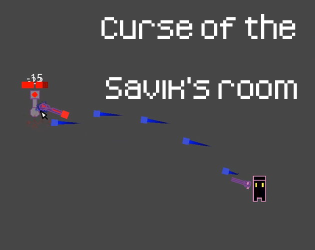

# [Curse of the savik's room](https://teamon.itch.io/curse-of-the-saviks-room)
Made in 48 hours for [Stepico Game Jam](https://jam.stepico.com/)  
Theme: Growth  

 

2d top-down action roguelike where you fight agains room. Can be player with keyboard and mouse or gamepad.

# Key features
 * 3 different ranged weapons
 * Gamepad and keyboard controls
 * Multilanguage support
 * 3 enemy types
 * 1 boss
 * Player and level progression
 * 8 hand-designed levels
 
 
# What is Stepico game jam?
AB Game Jam it's game jam hosted by Stepico Games online. Is an event where you create a game from scratch in a weekend based on a theme.

# Credits
 * [Team-on](https://github.com/Team-on) - programmer
 * Shoddy_Shamo - artist

# Used tools
 * Unity 2020.2.0f1
 * Visual Studio 2019
 * Aseprite
 * Adobe Photoshop 2020
 * sfxr

# Used assets
 * Unity game template - https://github.com/Team-on/UnityGameTemplate
 * Assets from template - https://github.com/Team-on/UnityGameTemplate/wiki/Used-assets
 * game-icons.net - UI icons
 * https://opengameart.org/content/rock-theme - main menu theme
 * https://opengameart.org/content/dark-electronic-rock-instrumental-nin-style - game theme
 
 
# Downloads and Links
Available in [Windows, OSX, Linux, Android and Web](GAME_LINK).  
Consider downloading a game instead of playing the web version for better performance and stability.  
If you encounter any problem, please leave a issue!  

#### Mac Version Notes:
If you get "this package is from an unidentified developer" right click (or control-click) and select open. You should now get the option to open anyways.

#### Linux Version Notes:
Make sure to set the x86_64 as executable before running.

# Screenshots
  
  
  
  
